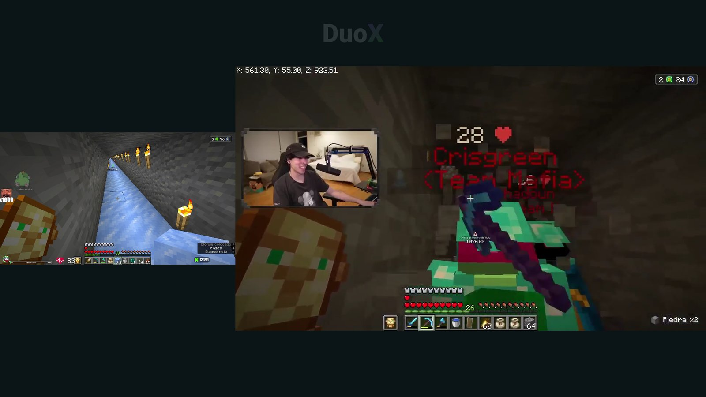

# DuoX TV

**Twitch y Kick en Fire TV y Android TV: multivista de hasta 4 canales, VOD sincronizados y búsqueda por voz.**

[Web](https://danikdejesus1.github.io/DuoX-TV/) · [Descargar APK](https://github.com/danikdejesus1/DuoX-TV/releases/latest/download/DuoX.apk) · [English](https://danikdejesus1.github.io/DuoX-TV/en/)



**English:** DuoX TV is a free, independent Twitch and Kick client for Amazon Fire TV and Android TV (Fire OS 7+ / Android 9+). It offers multiview of up to four channels, voice-synced VODs, voice search, QR chat and in-app updates, in a ~1.5 MB APK. Not affiliated with Twitch, Kick or Amazon.

**Creado por DanikDeJesus.** Cliente independiente para ver Twitch y Kick en Fire TV y Android TV, con navegación mediante mando.

## Descargar e instalar

El APK se publica en [Releases](https://github.com/danikdejesus1/DuoX-TV/releases). En Downloader basta con escribir el código **9565357**, o introducir el enlace directo:

`https://github.com/danikdejesus1/DuoX-TV/releases/latest/download/DuoX.apk`

Activa el permiso de instalación de aplicaciones desconocidas para Downloader, descarga el APK e instálalo. No necesitas un código numérico; este requiere crear un enlace corto aparte.

Requiere Android 9/API 28 o posterior; se ha probado en Fire OS 7. Las actualizaciones publicadas deben conservar el identificador y certificado de firma de DuoX TV.

Identificador Android: `tv.duox.tv`. Las actualizaciones deben conservar ese identificador y el certificado de firma.

El icono ↻ junto al idioma consulta nuevas versiones en GitHub y permite descargarlas. El instalador del dispositivo solicita la confirmación final y puede pedir autorizar instalaciones desde DuoX TV.

## Funciones

- Inicio con preview de directo, seguidos de Twitch/Kick y orden por espectadores.
- Panel LIVE con aro violeta para Twitch y verde para Kick.
- Canales OFFLINE con acceso a retransmisiones públicas.
- Reproductor nativo, calidad automática/manual y multivista de hasta cuatro canales.
- **VOD sincronizada:** hasta cuatro VOD a la vez con sugerencias por día y título, ajuste manual, corrección de deriva y alineación por voz cuando hay audio compartido.
- Barra de controles fina y translúcida con iconos: al enfocar uno aparece su nombre encima; junto a la pausa está el avatar del canal (abre su perfil). En multivista, el icono de audio solo aparece con varios directos y cambia de canal con arriba/abajo, uno cada vez.
- El indicador de audio en multivista aparece al empezar y al cambiar, y se desvanece a los 3 segundos.
- Buscador con teclado propio a la izquierda y canales reales a la derecha (Twitch y Kick), con los directos primero y los offline después. Twitch requiere la cuenta conectada; Kick es público.
- Chat más transparente con un QR pequeño debajo: abre en el móvil solo el chat del canal activo (popout público de Twitch/Kick). El QR no contiene credenciales; para escribir se necesita sesión en el móvil.
- Preview del inicio en marco 16:9 sin franjas negras ni deformar el vídeo.
- VOD con barra de tiempo, duración y desplazamiento con el mando.
- Continuar viendo dentro del perfil de cada canal: guarda el progreso local de hasta 20 VOD de Twitch/Kick; permite continuar, empezar de nuevo o quitar un vídeo de la fila.
- Perfiles con preview en vivo destacado, control de sonido y VOD fechados; acceso desde el buscador y desde el reproductor.
- Interfaz español/inglés, control de sonido del preview y avisos breves cuando un favorito entra en directo.
- HOME más oscuro, sin rebote al llegar al límite de desplazamiento, e introducción animada breve.
- Chat de Twitch con emotes; chat de Kick de lectura mediante su popout oficial.
- Conexión de cuentas, sin pedir contraseñas de Twitch dentro de la app.
- Sin servicio de traducción ni suscripción propia.

## Probar y reportar problemas

DuoX TV es una versión de pruebas. Cada persona inicia sesión con sus propias cuentas; el APK no incluye cuentas ni sesiones del creador.

Para reportar un fallo, abre un [Issue](https://github.com/danikdejesus1/DuoX-TV/issues) e indica el modelo del dispositivo, versión de Fire OS/Android, plataforma (Twitch o Kick), pasos para reproducirlo y lo que esperabas que ocurriera. Puedes adjuntar una captura sin datos personales. No publiques contraseñas, cookies, códigos de acceso ni tokens.

## Uso con mando

Selecciona un canal con las flechas y pulsa el botón central. Dentro del vídeo, el botón de menú o las flechas muestran los controles; estos se ocultan después de cinco segundos sin uso. En un VOD, sube hasta la barra y usa izquierda/derecha para moverte diez segundos. En multivista puedes elegir el audio y la calidad de cada pantalla.

El progreso se guarda cada 10 segundos y al salir o pausar. Los VOD vistos menos de 10 segundos y los terminados no aparecen en Continuar viendo. Este historial es local al dispositivo; no se sincroniza con las cuentas de Twitch/Kick. Si la plataforma retira un vídeo, el historial no permite recuperarlo.

## Compilar

El código fuente completo va como archivo `DuoX-2.2.0-codigo.zip` en el [release](https://github.com/danikdejesus1/DuoX-TV/releases/latest).

Necesitas JDK 17, Android SDK 35 y Build Tools 35.0.0. Configura `ANDROID_HOME` o un `local.properties` local con `sdk.dir`.

```sh
sh gradlew :app:assembleDebug :app:testDebugUnitTest :app:lintDebug
```

Para generar un APK sin depuración:

```sh
sh gradlew :app:assembleRelease
```

La salida release está recortada con R8 (código y recursos sin uso eliminados, solo español e inglés) y sin firmar: el mantenedor debe firmarla con su almacén privado usando `apksigner`. Nunca subas el almacén ni sus contraseñas. El APK debug generado localmente puede tener otro certificado y no sustituir la versión distribuida.

## Límites conocidos

Esta app no es oficial ni está afiliada a Twitch, Kick o Amazon. La reproducción y parte de la integración de Kick dependen de interfaces del sitio que pueden cambiar. Los servicios conservan sus condiciones y restricciones; DuoX TV no garantiza acceso a vídeos privados ni eliminación de anuncios de las plataformas. Los términos de Kick para desarrolladores indican el uso de su reproductor insertado: https://dev.kick.com/terms-of-service . La integración nativa actual es experimental.

Cuatro directos a máxima calidad pueden exceder la memoria o capacidad de decodificación del Fire TV HD. El chat de Kick es de lectura; no implementa envío con mando. No hay subtítulos traducidos por IA en esta versión. La compatibilidad no está certificada para todos los dispositivos.

## Privacidad y autoría

Consulta [PRIVACY.md](PRIVACY.md), [AUTHORS.md](AUTHORS.md) y [THIRD_PARTY_NOTICES.md](THIRD_PARTY_NOTICES.md). El identificador público del cliente OAuth de Twitch no es una contraseña; los tokens personales se generan al conectar cada cuenta y no se incluyen en este repositorio.

Copyright © 2026 DanikDeJesus. La publicación del código no concede por sí sola una licencia de reutilización; todavía no se ha elegido una licencia para el código original. Las dependencias conservan sus propias licencias.
